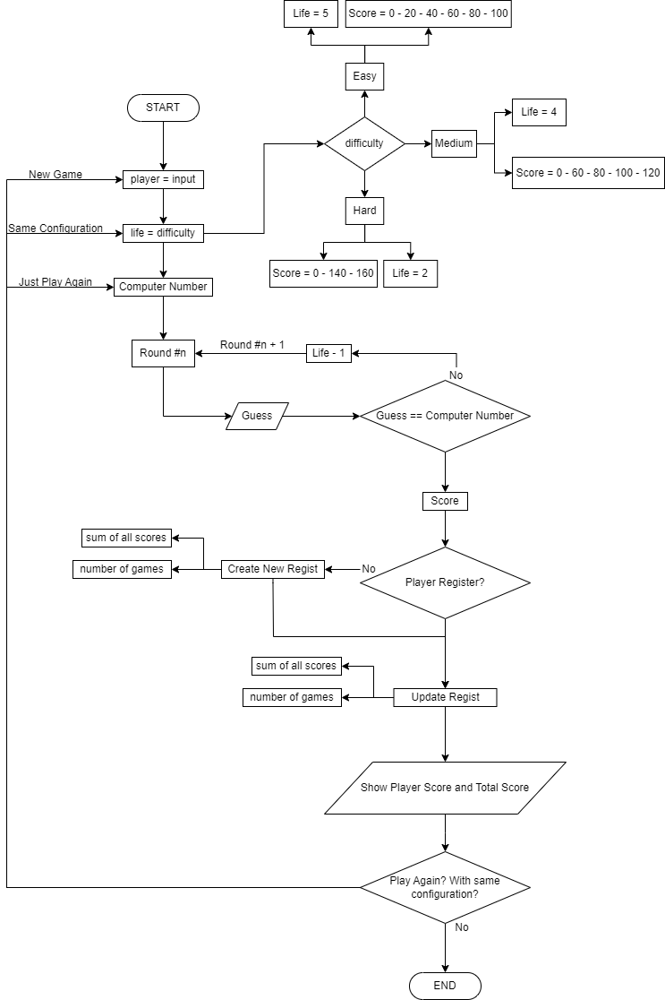

# python_studies
A repository for sharing my studies. Below you can read an about the codes:

## Abouts

### [Guess Game](https://github.com/matheusfarnetani/studies/blob/main/python_guess_game/guess_game.py)

  
Diagram

  

Develop a guess the number game, where the computer chooses a random integer from 0 to 10, and the user has 5 attempts to guess the number.
*  Implement a scoring system with the following behavior: if the user guesses the number on the first try, he will receive the maximum score (eg 100 points); if the user guesses the number in the last attempt, he will receive the minimum score (eg 10 points); if the user doesn't get the number right, he won't get any points.
* Implement error control. If the player enters a number outside the allowed range or non-numeric characters, the system must notify the player and request the correct entry.
* Implement the option for the user to start a new game. At the end of a round, after the final result, the game must ask if the player wants to start a new game and, if not, close the application.

### [Password Manager](https://github.com/matheusfarnetani/python_studies/blob/main/python_password_manager/password_manager.py)

A password manager software where you can store, generate and consult credentials from websites in your computer without needing to online in order to save your passwords into an account.

The data is stored locally in your computer in a JSON format.

  
How to Use

  
  * First, you need to write the name of the website. Pay attention on how you write the names, because this is how you will need to write, in order to search for your credentials.
  * Second, you need to provide your email or username.
  * After that you can write or generate a password.
  * Finnaly for saving the credentials you need to click in the add button, so that the program can open or create, if it is the first time you are saving information, your username and password.
  

If you want to change the data directory, simply change the constant DATA_DIRECTORY (line: 7) or if you want to constumize how many letters, numbers and symbol that you want in your password, change the randint function inside of a range function (lines: 17; 18; 19).

### [Snake Game](https://github.com/matheusfarnetani/python_studies/blob/main/python_snake_game/snake_game.py)

As know, the snake game is a classic one.

To play, simply run snake_game.py and use the arrows key to move.

The code was written using turtle library, so you don't need to install nothing more than python itself, it also saves the highscore of all time inside a .txt file and it was an exercise from Dr. Angela Yu's Python Bootcamp, in order to teach object oriented programming.
